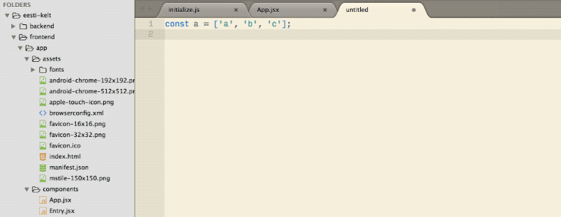

<div align="center">
  
</div>

# Sublime Text 3 Plugins for Frontend Web Development

Sublime is great and for many still the best text editor available. But out of the box, it lacks some features that modern competitors have already built-in. Plugins help to stay ahead but it's a hassle to keep up with all of them. In order to help you, I compiled a list of plugins I use for my daily frontend web development. 

If you know plugins that should be on this list, just open an issue. 😉

This list was shared by (among others):

* [Smashing Magazine](https://twitter.com/smashingmag/status/857784722373701632)
* [Umar Hansa](https://twitter.com/umaar/status/855385340105904128)
* [FrontendFocus](http://frontendfocus.co/issues/291) / [FrontendDaily](https://twitter.com/FrontEndDaily/status/868137687546568704)
* [Speckyboy](https://twitter.com/speckyboy/status/864145924053970945)


### Table of Contents
1. [Plugins](#plugins)
	1. [Administrative](#administrative)
	2. [General](#general)
	3. [Javascript](#javascript)
	4. [HTML & CSS](#htmlcss)
	5. [Linter](#linter)
	6. [Other](#other)
2. [Themes](#themes)
3. [Settings](#settings)

<a name="plugins"/>

## 1. Plugins

<a name="administrative"/>

### 🗃 i. Administrative 
These plugins are kind of 'meta' because they are not concerned with writing code.

* [Package Control](https://packagecontrol.io/packages/Package%20Control): This package enables you to install other packages. Since build 3124, you can install it within Sublime via <em>Tools</em> ➡ <em>Install Package Control</em>.
* [SideBarEnhacements](https://packagecontrol.io/packages/SideBarEnhancements): Adds features such as renaming to the sidebar.
* [Sync Settings](https://packagecontrol.io/packages/Sync%20Settings): Keep Sublime settings in sync via Github-Gist.
* [Package Syncing](https://packagecontrol.io/packages/Package%20Syncing): Keep all you settings, packages etc in sync via Dropbox and co

<a name="general"/>

### ⌨️ ii. General 
Useful for all languages.

* [All Autocomplete](https://packagecontrol.io/packages/All%20Autocomplete): Indexes all open files for auto-completion.
* [BracketHighlighter](https://packagecontrol.io/packages/BracketHighlighter): Improves the already built-in highlighting.
* [Terminal](https://packagecontrol.io/packages/Terminal): Open Terminal with current working directory set to the directory of the open file on a hot key.
* [AlignTab](https://packagecontrol.io/packages/AlignTab): Align your code by `:`, `=`, `=>`, `%`, ` `, `|` or your own RegEx.
* [GitGutter](https://packagecontrol.io/packages/GitGutter): Displays modified lines in the gutter (left to the line numbers).
* [Git](https://packagecontrol.io/packages/Git): Includes some git commands.
* [GitSavvy](https://packagecontrol.io/packages/GitSavvy): Full git and GitHub integration.
* [Gitignore](https://packagecontrol.io/packages/Gitignore): Fetches templates for the .gitignore provided by [Github](https://github.com/github/gitignore).
* [Local History](https://packagecontrol.io/packages/Local%20History): Keep a local history of your files.
* [Text Pastry](https://packagecontrol.io/packages/Text%20Pastry): Extend the power of multiple selections with features such as incremental numbers and date ranges.


<a name="javascript"/>

### ☕️ iii. Javascript
* [Tern for Sublime](https://packagecontrol.io/packages/tern_for_sublime): Static Javascript code analyzer with auto-completion, function argument hints, 'go to definition' and more. The installation and configuration can be a little bit tricky but it's worth it. Choose Tern over [SublimeCodeIntel](https://packagecontrol.io/packages/SublimeCodeIntel) (unmaintained) and [JavaScript Completions](https://packagecontrol.io/packages/JavaScript%20Completions) (buggy). 
* [JavaScript & NodeJS Snippets](https://packagecontrol.io/packages/JavaScript%20%26%20NodeJS%20Snippets)
* [JsPrettier](https://packagecontrol.io/packages/JsPrettier): Integration of [Prettier](https://github.com/prettier/prettier), the opinionated JavaScript formatter.
* [Console Wrap](https://packagecontrol.io/packages/Console%20Wrap): Fast way to log to console.
* [Babel](https://packagecontrol.io/packages/Babel): Syntax definitions for ES6 JavaScript with React JSX extensions.
* [TypeScript](https://packagecontrol.io/packages/TypeScript)
* [Elm Language Support](https://packagecontrol.io/packages/Elm%20Language%20Support)

<a name="htmlcss"/>

### 🎨 iv. HTML & CSS 
* [Sass](https://packagecontrol.io/packages/Sass): Sass is a preprocessor extending CSS and this plugins adds the language support.
* [SassSolutions](https://packagecontrol.io/packages/SassSolution): Auto-complete for variables and mixins from your 'settings.scss' file.
* [CSS3](https://packagecontrol.io/packages/CSS3): Replaces the built-in CSS support with a more up-to-date one. Includes [cssnext](http://cssnext.io) support. Follow the instructions to make it work properly.
* [Emmet](https://packagecontrol.io/packages/Emmet): Allows you to write HTML very fast. You have to learn their way though.
* [Color Highlighter](https://packagecontrol.io/packages/Color%20Highlighter)

<a name="other"/>

### 👥 vi. Other
* [Advanced CSV](https://packagecontrol.io/packages/Advanced%20CSV)

<a name="themes"/>

## 2. Themes

The built-in themes do not support recent syntax such as ES2015. In the following, I list some I have test and do it.

* [ayu](https://packagecontrol.io/packages/ayu)
* [Marterial Theme](https://packagecontrol.io/packages/Material%20Theme)

<a name="settings"/>

## 3. Settings
```
{
	"always_show_minimap_viewport": true,
	"animation_enabled": true,
	"auto_close_tags": true,
	"auto_complete": true,
	"auto_complete_commit_on_tab": true,
	"auto_complete_delay": 0,
	"auto_complete_with_fields": true,
	"auto_indent": true,
	"auto_match_enabled": true,
	"bold_folder_labels": true,
	"color_scheme": "Packages/ayu/ayu-dark.tmTheme",
	"default_line_ending": "unix",
	"detect_indentation": true,
	"draw_white_space": "all",
	"ensure_newline_at_eof_on_save": true,
	"find_selected_text": true,
	"font_face": "Droid Sans Mono",
	"highlight_line": true,
	"highlight_modified_tabs": true,
	"indent_subsequent_lines": true,
	"index_files": true,
	"match_brackets": true,
	"match_brackets_angle": true,
	"match_brackets_braces": true,
	"match_brackets_content": true,
	"match_brackets_square": true,
	"match_selection": true,
	"match_tags": true,
	"font_options":
	[
		"gray_antialias",
		"subpixel_antialias"
	],
	"font_size": 10,
	"highlight_line": true,
	"highlight_modified_tabs": false,
	"ignored_packages":
	[
		"Vintage"
	],
	"indent_guide_options":
	[
		"draw_normal",
		"draw_active"
	],
	"material_theme_accent_acid-lime": true,
	"material_theme_accent_scrollbars": true,
	"material_theme_bold_tab": true,
	"material_theme_bright_scrollbars": true,
	"material_theme_compact_panel": true,
	"material_theme_compact_sidebar": true,
	"material_theme_disable_fileicons": true,
	"material_theme_disable_folder_animation": true,
	"material_theme_disable_tree_indicator": true,
	"material_theme_panel_separator": true,
	"material_theme_small_statusbar": true,
	"material_theme_small_tab": true,
	"material_theme_tabs_autowidth": true,
	"material_theme_tabs_separator": true,
	"overlay_scroll_bars": "enabled",
	"scroll_past_end": true,
	"show_definitions": true,
	"show_encoding": true,
	"show_line_endings": true,
	"smart_indent": true,
	"tab_completion": true,
	"theme": "Material-Theme-Darker.sublime-theme",
	"trim_automatic_white_space": true,
	"trim_trailing_white_space_on_save": true,
	"word_wrap": "auto"
}

```

<a rel="license" href="http://creativecommons.org/licenses/by/4.0/"></a><br />This work is licensed under a <a rel="license" href="http://creativecommons.org/licenses/by/4.0/">Creative Commons Attribution 4.0 International License</a>.

